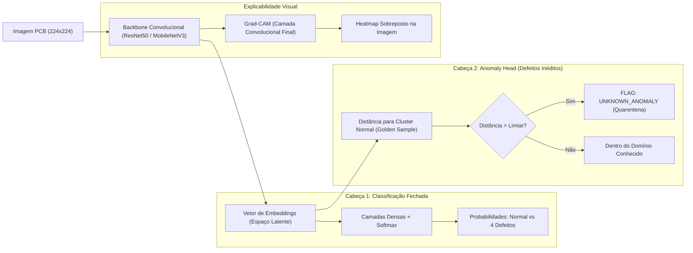
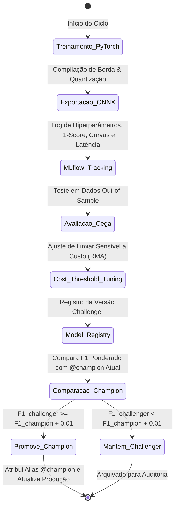

# 📐 PROJECT_SPEC: Especificação Técnica Detalhada do Sistema

> **Projeto:** Positivo Vision MLOps — Plataforma Industrial de Inspeção Visual, Otimização de Borda & Governança  
> **Nível:** Sênior / Staff ML Engineer (Padrão Global Scale-up / Tier 2)  
> **Empresa Alvo:** Positivo Tecnologia (POSI3)

---

## 1. Fundamentação & Análise Crítica de Gaps (Curso vs. Produção Industrial)

Confrontamos a abordagem ingênua/acadêmica de mercado com os desafios reais de chão de fábrica e computação de borda de uma multinacional listada na B3:

| Tópico | Abordagem Acadêmica Típica (Gaps de Mercado) | Padrão Sênior/Staff Implementado (Positivo Vision MLOps) |
| :--- | :--- | :--- |
| **Inferência & Borda (Edge)** | Execução do PyTorch/TensorFlow bruto em CPU (~150ms de latência). | **Exportação ONNX Runtime + Quantização INT8/FP16** (< 25ms em CPU fabril). |
| **Explicabilidade (XAI)** | Classificação "caixa-preta" (apenas rótulo e score de probabilidade). | **Grad-CAM (Class Activation Mapping)** gerando heatmap sobreposto na PCB com indicação visual exata do defeito para o técnico de retrabalho. |
| **Defeitos Desconhecidos** | Classificador fechado (*Closed-Set*) que alucina classes conhecidas em defeitos novos. | **Open-Set Anomaly Head (Latent Distance)**: Detecção de novidades via distância latente em relação ao cluster de PCBs normais, sinalizando `UNKNOWN_ANOMALY`. |
| **Inteligência de Causa-Raiz** | Nenhum auxílio ao operador; apenas código numérico de erro. | **Laudo Técnico Multimodal com GenAI**: Análise automática de causa-raiz no processo SMT (forno de refluxo, stencil de pasta de solda) e ação corretiva recomendada. |
| **Melhoria Contínua & Feedback** | Modelos estáticos sem conexão com o chão de fábrica. | **Human-in-the-Loop (HITL / Active Learning)**: Operador valida/corrige predições, alimentando streams Parquet para re-treinamento contínuo. |
| **Métrica de Decisão & Negócio** | F1-Score cego com threshold fixo de 0.50. | **Calibração de Limiar Sensível a Custo (Cost-Sensitive Threshold)**: Pondera Falso Negativo (RMA ~R$ 500) vs Falso Positivo (Retrabalho ~R$ 0,50). |
| **Model Registry** | Busca ingênua (`runs.iloc[0]`) e carregamento hardcoded de `models:/model/latest`. | **Champion vs Challenger** determinístico com Model Aliases (`@champion`) no MLflow e exigência de ganho $\ge +0.01$ no F1 out-of-sample. |
| **Triagem de Sinal (OOD)** | Qualquer imagem aleatória gera uma predição sem filtros. | **Filtro OOD (Out-of-Distribution)**: Verificação de variância Laplaciana (blur) e histograma de intensidade luminosa antes de passar pela rede. |
| **Telemetria de Produção** | Logs perdidos no stdout ou banco SQL lento. | **Gravação Assíncrona em Parquet** via FastAPI BackgroundTasks gerando stream colunar particionado para auditoria fabril. |
| **API & Contratos** | Flask síncrono monolítico com Swagger UI clássico. | **FastAPI Assíncrono**, Pydantic v2 estrito (`BaseSettings`), **Scalar Docs** e endpoints de orquestração (`/healthz`, `/ready`). |
| **Conteinerização & Deploy** | Containers como `root` rodando apenas localmente. | **Multi-stage Docker non-root** publicado online no **Google Cloud Run** com **Scale-to-Zero** (custo \$0/mês). |

---

## 2. Ingestão de Dados & Dataset Benchmark

1. **Fonte Principal:** **PCB Defect Benchmark & MVTec AD Electronics Subsets**:
   * Amostras industriais de alta resolução de placas de circuito impresso.
   * Classes Mapeadas:
     * `NORMAL`: Placa conforme, sem anomalias de fabricação.
     * `DEFECT_SHORT`: Curto-circuito por excesso de solda ou filete condutor.
     * `DEFECT_OPEN`: Trilha rompida / circuito aberto.
     * `DEFECT_MISSING_HOLE`: Furo de fixação ou passagem ausente.
     * `DEFECT_SPURIOUS`: Cobre espúrio ou rebarba metálica na placa.
2. **Data Augmentation para Ambientes Fabris:**
   * Jitter de brilho e contraste (*Brightness & Contrast Jitter*) simulando variações de luminosidade de galpões de montagem.
   * Rotações discretas (90°, 180°, 270°) e perturbações leves de perspectiva (vibração mecânica da câmera de esteira).
   * Redimensionamento padronizado para $224 \times 224$ com normalização ImageNet.
3. **Triagem de Imagem & Detecção Out-of-Distribution (OOD):**
   * Antes da inferência neural, a imagem passa por teste estatístico rápido:
     * **Blur Detection:** Variância do operador Laplaciano ($\sigma^2 < \text{threshold}$ alerta câmera fora de foco ou trepidação mecânica).
     * **Luminance Check:** Média e desvio padrão dos pixels no espaço HSV para rejeitar oclusões da lente ou falha na iluminação da esteira.

---

## 3. Arquitetura Neural Híbrida: Classificação, Anomaly Head & ONNX

* **Backbone:** ResNet50 / MobileNetV3-Large atuando como extrator de features profundas.
* **Open-Set Anomaly Head:**
  - Extração do vetor de embedding latente antes das camadas densas.
  - Cálculo de distância cosseno/euclidiana em relação ao centroide da classe `NORMAL` (Golden Sample homologada).
  - Se a distância superar o limiar de tolerância $\tau_{\text{anomalia}}$ e a entropia das classes conhecidas for elevada, a predição é sinalizada como `UNKNOWN_ANOMALY`, evitando que novos defeitos passem despercebidos.
* **Otimização de Borda (ONNX Runtime):**
  - Exportação automatizada dos grafos para `.onnx` com quantização dinâmica (FP16/INT8).
  - Latência $< 25\text{ms}$ em processadores x86 comuns em CPU de linha fabril.
* **Explicabilidade Visual (Grad-CAM):**
  - Hook na camada convolucional final (`layer4`).
  - Geração do mapa de ativação ponderado por gradientes interpolado e renderizado via colormap JET/Viridis, retornado em Base64 para a interface.

---

## 4. Governança com MLflow & Regras de Negócio (RMA Shield)

### Matriz de Custo Fabril:
* $\text{Custo}(\text{Falso Positivo}) \approx \text{R\$} 0,50$ (Re-inspeção na bancada).
* $\text{Custo}(\text{Falso Negativo}) \approx \text{R\$} 500,00$ (Placa defeituosa vendida, RMA, frete reverso, perda de marca).
* Otimização da função de custo para garantir sensibilidade/recall $> 99\%$ em defeitos críticos.

---

## 5. Microsserviço de Inferência (FastAPI + Pydantic v2 + GenAI + HITL)

### Endpoints da API:
1. `GET /healthz` ➔ Liveness probe para Kubernetes / Cloud Run (`{"status": "healthy"}`).
2. `GET /ready` ➔ Readiness probe confirmando inicialização do modelo ONNX e sessão de inferência.
3. `POST /api/v1/predict` ➔ Recebe arquivo de imagem (`multipart/form-data`) e retorna predição, probabilidade, latência em ms, flags OOD, flag de anomalia inédita (`is_unknown_anomaly`) e imagem Grad-CAM em Base64.
4. `GET /api/v1/predict-random` ➔ Sorteia amostra industrial do pool interno para a Live Demo em 1-clique.
5. `POST /api/v1/generate-report` ➔ Consome metadados da inferência e gera o **Laudo Técnico de Causa-Raiz Multimodal (GenAI)** com análise para engenharia de processos SMT e bancada de retrabalho. Powered by **OpenCode Go** utilizando o modelo de altíssimo custo-benefício **`DeepSeek V4.1 Flash`** (26.000 reqs/5h) via API assíncrona compatível com OpenAI.
6. `POST /api/v1/feedback` ➔ Registra o feedback humano do operador de bancada (`is_correct`, `corrected_class`), enriquecendo o stream Parquet com flag `requires_retrain=True`.
7. `GET /api/v1/telemetry/stats` ➔ Estatísticas agregadas da esteira lidas do stream Parquet (total inspecionado, taxa de defeitos, latência média p95, taxa de concordância do operador).
8. **Rate Limiting & FinOps Guardrail:** Middleware de controle de tráfego por IP limitando visitantes anônimos a **25 testes a cada 2 horas** na inferência e **10 laudos a cada 2 horas** no gerador GenAI. Fornece cabeçalho de contornamento via `ADMIN_BYPASS_KEY` para demonstração sem travas na entrevista e retorno elegante `HTTP 429 Too Many Requests`.
9. `GET /docs` ➔ Servido via **Scalar OpenAPI**.

---

## 6. Interface de Demonstração Executiva (Live Demo UI)

* Servida em `/demo` através de interface industrial limpa e responsiva (HTML5/Tailwind/JS).
* **Painel de Controle e Recursos:**
  * **Badge de Cota de Demonstração:** Indicador em tempo real: *"🔒 Sessão Pública: 24/25 testes restantes (Redefine a cada 2h)"*.
  * **Botão 1 (Ação Rápida na Entrevista):** *"🎲 Simular Leitura da Câmera na Esteira (Amostra Aleatória)"*.
  * **Botão 2:** *"📁 Fazer Upload de Imagem Externa"*.
  * **Chave de Alternância (Toggle):** Alternar entre Imagem Original da PCB e Heatmap Grad-CAM sobreposto.
  * **Botão GenAI:** *"📄 Gerar Laudo Técnico SMT (DeepSeek V4.1)"* ➔ Abre modal com análise técnica detalhada.
  * **Botões Human-in-the-Loop:** *"✅ Validar Diagnóstico"* ou *"✏️ Corrigir (Falso Positivo)"* com feedback visual imediato.
  * **Cards de Telemetria:** Status (Conforme / Reprovada / Anomalia Inédita), Latência ONNX em ms, Probabilidades por classe e Modelo ativo (`@champion`).

---

## 7. Conteinerização, Deploy Serverless em Nuvem & CI/CD

* **Dockerfile Multi-Stage Profissional:**
  * Builder isolado com `uv` e imagem final mínima `python:3.12-slim`.
  * Execução obrigatória como usuário não-privilegiado `appuser`.
* **Deploy Cloud Serverless (Google Cloud Run):**
  * Política de **Scale-to-Zero** (mínimo de instâncias = 0, máximo = 3) mantendo o custo em **\$0/mês**.
  * Cold-start ultra-rápido (< 4s) com ONNX Runtime.
  * Script automatizado `scripts/deploy_cloudrun.sh` com provisionamento declarativo.
* **Pipeline de CI/CD (GitHub Actions):**
  * Linting (`ruff`), tipagem (`mypy`), testes unitários (`pytest`), build Docker e continuous deployment no Cloud Run.
