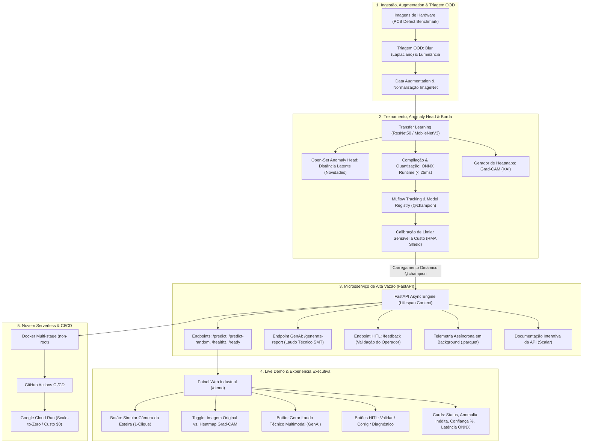

# 🏭 Positivo Vision MLOps: Inspeção Visual Automatizada, Otimização de Borda & Governança

[](https://dagshub.com/henriquebotelhogomes/positivo-vision-mlops.mlflow)
[](https://dagshub.com/henriquebotelhogomes/positivo-vision-mlops.mlflow/#/models/positivo-pcb-vision)
[](https://www.python.org/)
[](https://fastapi.tiangolo.com/)
[](https://onnxruntime.ai/)

> **Sistema Industrial de MLOps & Visão Computacional para Linhas de Montagem (Padrão Staff / Global Scale-up)**  
> **Target:** Positivo Tecnologia (POSI3) — Desenvolvedor de IA Sênior (Remoto / CLT).  
> **MLflow na Nuvem:** [DagsHub Remote Tracking](https://dagshub.com/henriquebotelhogomes/positivo-vision-mlops.mlflow)  
> **Hospedagem Online:** Google Cloud Run (Serverless / Scale-to-Zero).

---

## 📌 1. Visão Geral do Projeto & Contexto de Negócio

Nas unidades industriais da **Positivo Tecnologia** (como Curitiba e Manaus), milhares de placas de circuito impresso (PCBs), módulos de hardware e componentes eletrônicos passam por esteiras SMT (*Surface Mount Technology*) em alta velocidade. A inspeção visual manual de defeitos (curto-circuitos em soldas, furos ausentes, trilhas rompidas ou cobre espúrio) gera gargalos de produção, alto custo operacional e risco severo de devoluções por garantia (**RMA - Return Merchandise Authorization**).

O **Positivo Vision MLOps** é uma solução completa de engenharia de IA de ponta a ponta com diferenciais industriais de nível Staff:
1. **Modelagem & Visão Computacional Industrial:** Treinamento via *Transfer Learning* (ResNet / MobileNetV3) utilizando benchmarks industriais de alta fidelidade (PCB Defect Dataset / MVTec AD).
2. **Detecção de Defeitos Inéditos (Open-Set Anomaly Head):** Camada de detecção no espaço latente de embeddings capaz de identificar anomalias desconhecidas que nunca estiveram no dataset de treino (`UNKNOWN_ANOMALY`), impedindo que novas falhas passem como placas normais.
3. **Otimização de Borda (Edge Computing):** Compilação e quantização dos grafos neurais para **ONNX Runtime** (FP16/INT8), reduzindo a latência para **< 25ms** em CPUs comuns de chão de fábrica.
4. **Explicabilidade Visual (XAI) com Grad-CAM:** Mapeamento visual térmico em tempo real sobreposto à PCB, indicando exatamente ao operador onde está localizado o defeito para correção imediata.
5. **Laudo Técnico de Causa-Raiz Multimodal (GenAI Industrial):** Geração sob demanda de análise de causa-raiz para engenharia de processos SMT (estação de stencil, forno de refusão) com ação corretiva recomendada, alimentado pelo modelo **DeepSeek V4.1 Flash** via **OpenCode Go** (26.000 requisições/5h).
6. **Governança com MLflow & RMA Shield:** Model Registry com política **Champion vs. Challenger** (`@champion`) e calibração de limiar sensível a custo (Falso Negativo ~R$ 500 vs. Falso Positivo ~R$ 0,50).
7. **Human-in-the-Loop (Active Learning):** Operador de bancada valida ou corrige predições na interface, alimentando streams Parquet para re-treinamento contínuo.
8. **Microsserviço FastAPI, Rate Limiting & Telemetria em Parquet:** API assíncrona com **Scalar Docs**, validação **Pydantic v2**, telemetria e **Rate Limiting FinOps (25 reqs/2h por IP)** para blindagem contra exaustão de cotas na demonstração pública.
9. **Deploy Serverless na Nuvem (Cloud Run):** Dockerfile multi-stage (usuário `appuser`) publicado no **Google Cloud Run** com política de **Scale-to-Zero** (custo \$0/mês).

---

## 🏛️ 2. Arquitetura do Sistema



---

## 🛠️ 3. Stack Tecnológica & Princípios de Engenharia

* **Linguagem & Manifesto:** Python 3.12+ gerenciado estritamente via **`uv`** com `pyproject.toml` (PEP 621) e `uv.lock`.
* **Deep Learning & Borda:** PyTorch + **ONNX Runtime** (quantização FP16/INT8).
* **Open-Set Anomaly Detection:** Anomaly Head baseado em distância no espaço latente de embeddings.
* **Explicabilidade (XAI) & GenAI:** Grad-CAM térmico via OpenCV + Módulo Multimodal de Causa-Raiz.
* **MLOps & Governança:** MLflow (Tracking, Artifacts, Model Registry e Model Aliases).
* **Engenharia de Dados & Telemetria:** Apache Arrow / **Polars** e gravação colunar `.parquet`.
* **API de Produção:** FastAPI assíncrono, **Pydantic v2** (`pydantic-settings`), logging estruturado via **`structlog`** e **Scalar Docs**.
* **Demonstração:** Interface web limpa em HTML5/Tailwind/JavaScript servida em `/demo`.
* **Conteinerização & Nuvem:** Docker multi-stage build, usuário `non-root`, Google Cloud Run (Serverless FinOps) e GitHub Actions.

---

## 📂 4. Estrutura do Repositório

```text
positivo-vision-mlops/
├── .github/
│   └── workflows/
│       └── ci.yml               # Pipeline de CI/CD automatizado
├── data/
│   ├── raw/                     # Amostras originais do dataset
│   ├── sample_pool/             # Pool de imagens industriais para a Live Demo
│   └── telemetry/               # Streams de predição e feedback HITL em .parquet
├── src/
│   ├── core/                    # Configurações (Pydantic-settings) e structlog
│   ├── data/                    # Ingestão, pré-processamento, augmentations e triagem OOD
│   ├── models/                  # Arquitetura neural, Anomaly Head, Grad-CAM e ONNX
│   ├── training/                # Pipeline de treino, MLflow Tracking e calibração de custo
│   ├── registry/                # Lógica Champion vs. Challenger com Model Aliases
│   ├── api/                     # Microsserviço FastAPI, GenAI, HITL e Scalar Docs
│   └── monitoring/              # Gravação de telemetria assíncrona em Parquet
├── scripts/
│   └── deploy_cloudrun.sh       # Script de deploy automatizado no Google Cloud Run
├── tests/                       # Testes unitários determinísticos (pytest)
├── Dockerfile                   # Multi-stage build seguro (non-root)
├── docker-compose.yml           # Orquestração local: API + Servidor MLflow
├── PROJECT_SPEC.md              # Especificação técnica aprofundada
├── INTERVIEW_PLAYBOOK.md        # Roteiro tático e respostas para a entrevista Positivo
├── TASKS.md                     # Backlog de implementação
└── README.md                    # Documentação principal
```

---

## 🚀 5. Como Executar

### Execução Local Rápida (com `uv`):
```bash
# 1. Instalar dependências em ambiente virtual isolado
uv venv
uv pip install -e .

# 2. Iniciar a API com hot-reload
uv run uvicorn src.api.main:app --host 0.0.0.0 --port 8000 --reload
```

### Execução com Docker Compose:
```bash
docker compose up -d
```

### Acesso aos Serviços:
* **Interface da Live Demo:** `http://localhost:8000/demo` (ou link público no Cloud Run)
* **MLflow na Nuvem (DagsHub):** [https://dagshub.com/henriquebotelhogomes/positivo-vision-mlops.mlflow](https://dagshub.com/henriquebotelhogomes/positivo-vision-mlops.mlflow)
* **Model Registry Oficial:** [Modelo `positivo-pcb-vision` (@champion)](https://dagshub.com/henriquebotelhogomes/positivo-vision-mlops.mlflow/#/models/positivo-pcb-vision)
* **MLflow Local:** `http://localhost:5000` (quando executado localmente)
* **Documentação Interativa Scalar:** `http://localhost:8000/docs`
* **Probes de Saúde:** `http://localhost:8000/healthz` e `http://localhost:8000/ready`
