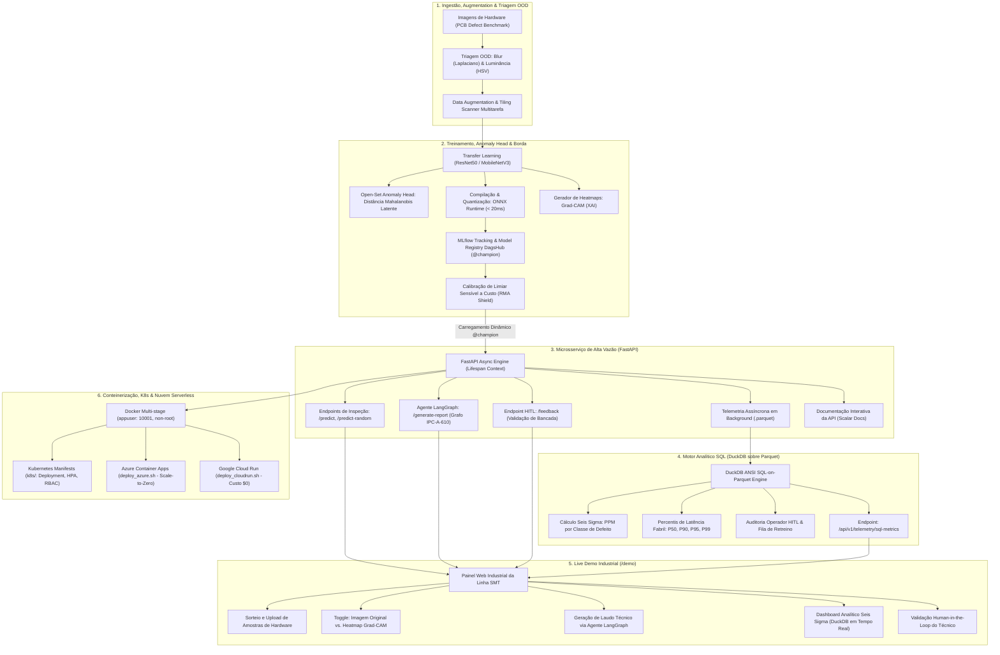

# 🏭 Positivo Vision MLOps: Inspeção Visual Automatizada, Otimização de Borda & Governança Enterprise

[](https://positivo-vision-197215016090.us-central1.run.app/demo)
[](https://dagshub.com/henriquebotelhogomes/positivo-vision-mlops.mlflow)
[](https://dagshub.com/henriquebotelhogomes/positivo-vision-mlops.mlflow/#/models/positivo-pcb-vision)
[](https://www.python.org/)
[](https://fastapi.tiangolo.com/)
[](https://onnxruntime.ai/)
[](https://duckdb.org/)
[](https://langchain-ai.github.io/langgraph/)
[](https://kubernetes.io/)
[](https://cloud.google.com/run)
[](tests/)

> **Sistema Industrial de MLOps, Visão Computacional & IA Generativa para Manufatura Eletrônica (Padrão Staff / Global Scale-up)**  
> **Candidatura:** Positivo Tecnologia (POSI3) — Desenvolvedor de IA Sênior (Remoto / CLT).  
> **🚀 Aplicação Online (Live Demo Cloud Run):** [https://positivo-vision-197215016090.us-central1.run.app/demo](https://positivo-vision-197215016090.us-central1.run.app/demo)  
> **📑 Documentação Scalar Online:** [https://positivo-vision-197215016090.us-central1.run.app/docs](https://positivo-vision-197215016090.us-central1.run.app/docs)  
> **MLflow na Nuvem:** [DagsHub Remote Tracking Server](https://dagshub.com/henriquebotelhogomes/positivo-vision-mlops.mlflow)  
> **Model Registry Oficial:** [Modelo `positivo-pcb-vision` (@champion)](https://dagshub.com/henriquebotelhogomes/positivo-vision-mlops.mlflow/#/models/positivo-pcb-vision)  
> **Deploy Multi-Cloud:** Google Cloud Run (Ativo / Scale-to-Zero) & Azure Container Apps (`scripts/deploy_azure.sh`).

---

## 📌 1. Visão Geral do Projeto & Contexto de Negócio

Nas linhas de montagem da **Positivo Tecnologia** (fábricas de Curitiba, Manaus e Ilhéus), centenas de milhares de placas de circuito impresso (PCBs), módulos de memória e placas-mãe passam por esteiras SMT (*Surface Mount Technology*) em alta velocidade. A inspeção visual humana de defeitos microscópicos (pontes de solda, furos ausentes, trilhas rompidas ou mordidas de mouse) gera gargalos de ciclo, fadiga operacional e risco de devoluções por garantia (**RMA - Return Merchandise Authorization**).

O **Positivo Vision MLOps** é uma solução completa de engenharia de IA de ponta a ponta, projetada sob rigorosos padrões industriais de manufatura classe 3:

1. **Modelagem & Tiling Scanner Multitarefa:** Treinamento em PyTorch com *Transfer Learning* e motor de varredura por recortes (*Tiling Grid*) para localização de micro-defeitos em imagens de altíssima resolução nas 7 classes canônicas de falhas SMT.
2. **Detecção de Defeitos Inéditos (Open-Set Anomaly Head):** Camada de detecção no espaço latente de embeddings (Distância de Mahalanobis e Cosseno em relação ao centróide de placas sadias), sinalizando `UNKNOWN_ANOMALY` para anomalias que nunca estiveram no dataset de treino.
3. **Compilação & Otimização de Borda (Edge Inference):** Exportação e quantização dinâmica para **ONNX Runtime** (FP16/INT8), atingindo latências industriais ultrarrápidas (**< 20ms** em CPU fabril comum).
4. **Explicabilidade Visual (XAI) com Grad-CAM:** Mapeamento de calor Grad-CAM sobreposto à PCB em tempo real, delimitando as coordenadas exatas da anomalia para orientação visual imediata do operador.
5. **Agente de Causa-Raiz SMT com LangGraph:** Orquestrador com grafo de estados (`StateGraph`) integrando o diagnóstico visual a um **Grafo de Conhecimento IPC-A-610 Class 3**. Analisa viscosidade de pasta SAC305, stencil, pick-and-place e perfil térmico de fornos de refluxo (zonas 1 a 8) para emitir laudos técnicos de engenharia com roteamento fabril automatizado.
6. **Motor Analítico SQL em Tempo Real (DuckDB sobre Parquet):** Execução de consultas analíticas ANSI SQL de altíssima performance diretamente sobre o stream colunar `inferences.parquet`, calculando **PPM Seis Sigma** por classe e percentis de SLA de latência (`P50`, `P90`, `P95`, `P99`).
7. **Governança MLOps na Nuvem (DagsHub MLflow):** Rastreamento remoto de experimentos, métricas, parâmetros e Model Registry com promoção determinística via Aliases (`@champion` vs. `@challenger`).
8. **Métricas de Negócio & RMA Shield:** Calibração de limiar de decisão (*Cost-Sensitive Threshold Tuning*) priorizando Recall na detecção de defeitos para mitigar custos de devoluções por garantia (RMA ~R$ 500) sem onerar falsos positivos de retrabalho (~R$ 0,50).
9. **Human-in-the-Loop & Active Learning:** Endpoint de feedback permitindo que técnicos de bancada validem ou retifiquem diagnósticos, marcando amostras com flag `requires_retrain=True` para ciclo fechado de aprendizado contínuo.
10. **Infraestrutura Enterprise & Multi-Cloud:** Manifests completos de **Kubernetes de Produção (`k8s/`)** com HPA, isolamento não-privilegiado (`runAsNonRoot: true`), scripts para **Azure Container Apps** e **Google Cloud Run** com política estrita de **Scale-to-Zero** (custo \$0/mês quando ocioso).

---

## 🏛️ 2. Arquitetura do Sistema



---

## 🛠️ 3. Stack Tecnológica & Princípios de Engenharia

| Componente | Tecnologia | Papel na Solução |
| :--- | :--- | :--- |
| **Linguagem & Manifesto** | Python 3.12+ / `uv` / `pyproject.toml` | Gerenciamento determinístico de dependências com lockfile `uv.lock`. |
| **Deep Learning & Borda** | PyTorch / Torchvision / **ONNX Runtime** | Treinamento, exportação de grafos neurais e quantização dinâmica FP16/INT8. |
| **Detecção Open-Set** | Scikit-Learn / NumPy | Detecção de anomalias inéditas via distância no espaço latente de embeddings. |
| **Explicabilidade (XAI)** | Grad-CAM / OpenCV | Mapas de ativação de classes sobrepostos para localização visual do defeito. |
| **Agente Inteligente SMT** | **LangGraph** / LangChain Core | Grafo de estados para diagnóstico de causa-raiz e normas **IPC-A-610 Class 3**. |
| **Motor Analítico SQL** | **DuckDB** | Consultas analíticas ANSI SQL em tempo real sobre telemetria Parquet (Seis Sigma PPM). |
| **Engenharia de Dados** | Apache Arrow / **Polars** / Parquet | Armazenamento colunar de alta vazão para telemetria fabril e auditoria. |
| **API & Microsserviço** | **FastAPI** / Pydantic v2 / Structlog | Framework assíncrono com Lifespan context manager, fail-fast e logs estruturados em JSON. |
| **Documentação de API** | **Scalar** | Interface moderna servida em `/docs` (sem Swagger legada). |
| **MLOps & Governança** | **MLflow** / **DagsHub** | Rastreamento remoto na nuvem, artefatos, Model Registry e aliases `@champion`. |
| **Orquestração de Borda** | **Kubernetes (`k8s/`)** / Kustomize | Deploy declarativo com HPA (2 a 10 réplicas), probes `/healthz` e `/ready` e segurança non-root. |
| **Nuvem Serverless & FinOps** | **Azure Container Apps** / **GCP Cloud Run** | Publicação multi-cloud serverless com política Scale-to-Zero (custo zero ocioso). |
| **Qualidade & Testes** | **Pytest** / Ruff | 23 testes unitários determinísticos com 100% de aprovação e linting rigoroso. |

---

## 📂 4. Estrutura do Repositório

```text
positivo-vision-mlops/
├── .github/
│   └── workflows/
│       └── ci.yml               # Pipeline de CI/CD automatizado (Lint, Test, Build)
├── data/
│   ├── raw/                     # Amostras do benchmark industrial
│   ├── sample_pool/             # Pool de imagens industriais reais para a Live Demo
│   └── telemetry/               # Streams de predição e feedback HITL em inferences.parquet
├── k8s/                         # Manifests declarativos de Produção Kubernetes
│   ├── namespace.yaml           # Namespace isolado: positivo-vision
│   ├── configmap.yaml           # Configurações de ambiente desvinculadas de código
│   ├── secret.yaml.example      # Template de credenciais e chaves de bypass
│   ├── deployment.yaml          # RollingUpdate, runAsNonRoot: true, appuser 10001 e Probes
│   ├── service.yaml             # Service ClusterIP porta 80 -> 8000
│   ├── hpa.yaml                 # Horizontal Pod Autoscaler (2 a 10 réplicas / 70% CPU)
│   └── kustomization.yaml       # Kustomize GitOps pronto para deploy
├── models/
│   ├── champion.onnx            # Modelo ONNX otimizado e quantizado em produção
│   ├── anomaly_centroid.npz     # Centróide e covariância para detecção Open-Set
│   └── best_model.pt            # Checkpoint PyTorch para Grad-CAM e extração latente
├── scripts/
│   ├── deploy_cloudrun.sh       # Deploy automatizado no Google Cloud Run (Scale-to-Zero)
│   ├── deploy_azure.sh          # Deploy automatizado no Azure Container Apps (Bash)
│   ├── deploy_azure.ps1         # Deploy automatizado no Azure Container Apps (PowerShell)
│   ├── sync_dagshub.py          # Script de sincronização MLflow local -> DagsHub Cloud
│   └── run_training.py          # Script de orquestração do treinamento e registro MLflow
├── src/
│   ├── core/                    # Configurações com Pydantic-settings e structlog
│   ├── data/                    # Ingestão, pré-processamento, augmentations e triagem OOD
│   ├── models/
│   │   ├── vision_net.py        # Backbone neural ResNet/MobileNet para 7 classes canônicas
│   │   ├── anomaly_head.py      # Open-Set Anomaly Detector (Mahalanobis / Cosseno)
│   │   ├── gradcam.py           # Engine de explicabilidade visual Grad-CAM
│   │   └── smt_graph_agent.py   # Agente LangGraph com Grafo de Conhecimento IPC-A-610
│   ├── monitoring/
│   │   ├── telemetry.py         # Gravação assíncrona de inferências e HITL em Parquet
│   │   └── sql_analytics.py     # Motor analítico ANSI SQL DuckDB (PPM Seis Sigma e SLA)
│   ├── training/                # Pipeline de treino, log MLflow e calibração de custo RMA
│   ├── registry/                # Governança de modelos Champion vs. Challenger
│   └── api/
│       ├── main.py              # Aplicação FastAPI, lifespan, endpoints e Rate Limiter
│       ├── schemas.py           # Contratos tipados de entrada e saída Pydantic v2
│       ├── static/              # Assets estáticos (identidade visual Positivo)
│       └── templates/
│           └── demo.html        # Interface Web industrial com abas de XAI e DuckDB SQL
├── tests/                       # Bateria de 23 testes unitários (Pytest)
├── Dockerfile                   # Multi-stage build seguro (non-root / appuser 10001)
├── docker-compose.yml           # Orquestração local: API + Servidor MLflow
├── pyproject.toml               # Manifesto PEP 621 com dependências controladas
├── uv.lock                      # Lockfile determinístico uv
├── PROJECT_SPEC.md              # Especificação técnica enterprise do projeto
├── INTERVIEW_PLAYBOOK.md        # Playbook executivo com perguntas de alto calibre
├── TASKS.md                     # Rastreamento completo de fases do projeto
└── README.md                    # Este documento
```

---

## 🚀 5. Como Executar

### Pré-requisitos
* Python 3.12+ instalado.
* Gerenciador de pacotes **`uv`** instalado (`pip install uv` ou via instalador nativo).
* Git e Docker (opcional, para conteinerização).

### 1. Inicialização Local Rápida (com `uv`)
```bash
# Clonar o repositório
git clone https://github.com/henriquebotelhogomes/positivo-vision-mlops.git
cd positivo-vision-mlops

# Criar ambiente virtual e instalar dependências determinísticas
uv sync --all-extras

# Iniciar a API em ambiente de desenvolvimento
uv run uvicorn src.api.main:app --host 0.0.0.0 --port 8000 --reload
```

### 2. Inicialização do Servidor MLflow Local
```bash
uv run python -m mlflow ui --backend-store-uri sqlite:///mlflow.db --host 0.0.0.0 --port 5000 --workers 1
```

### 3. Execução dos Testes Automatizados e Linter
```bash
# Executar a suíte de 23 testes unitários
uv run pytest -v

# Verificar conformidade de estilo e padrões de código
uv run ruff check .
```

### 4. Deploy no Kubernetes (`k8s/`)
```bash
# Aplicar todos os manifests declarativos via Kustomize
kubectl apply -k k8s/

# Verificar status dos pods e do HPA
kubectl get pods -n positivo-vision
kubectl get hpa -n positivo-vision
```

### 5. Deploy Multi-Cloud Serverless (Azure ou GCP)
* **Google Cloud Run:**
  ```bash
  bash scripts/deploy_cloudrun.sh
  ```
* **Azure Container Apps:**
  ```bash
  bash scripts/deploy_azure.sh
  # Ou no Windows PowerShell:
  .\scripts\deploy_azure.ps1
  ```

---

## 🌐 6. Endpoints & Serviços Disponíveis

| Serviço | Rota / URL Online (Cloud Run) | Rota Local | Descrição |
| :--- | :--- | :--- | :--- |
| **Live Demo Industrial** | [Abrir Live Demo Online](https://positivo-vision-197215016090.us-central1.run.app/demo) | `http://localhost:8000/demo` | Painel web com sorteio de amostras, toggle XAI, laudo LangGraph e DuckDB SQL. |
| **Documentação Scalar** | [Abrir Scalar Docs Online](https://positivo-vision-197215016090.us-central1.run.app/docs) | `http://localhost:8000/docs` | Documentação interativa moderna da API REST. |
| **Sorteio de Amostra** | `/api/v1/predict-random` | `GET /api/v1/predict-random` | Sorteia PCB do pool, executa ONNX + Anomaly Head + Grad-CAM (< 20ms). |
| **Laudo Técnico SMT** | `/api/v1/generate-report` | `POST /api/v1/generate-report` | Executa o agente LangGraph sobre as normas IPC-A-610 Class 3. |
| **Métricas SQL DuckDB** | [Ver JSON Online](https://positivo-vision-197215016090.us-central1.run.app/api/v1/telemetry/sql-metrics) | `GET /api/v1/telemetry/sql-metrics` | Retorna o relatório Seis Sigma PPM e percentis de latência P99. |
| **Feedback de Bancada** | `/api/v1/feedback` | `POST /api/v1/feedback` | Registra auditoria HITL com enfileiramento para retreino. |
| **Probes Cloud / K8s** | `/ready` | `GET /ready` | Sondas de readiness para orquestradores k8s e Cloud Run. |
| **DagsHub Cloud MLflow** | [DagsHub Remote MLflow](https://dagshub.com/henriquebotelhogomes/positivo-vision-mlops.mlflow) | `http://localhost:5000` | Painel na nuvem com tracking de runs e Model Registry oficial. |

---

## 💬 7. Exemplos de Consumo da API via CLI

### Consultar Métricas Seis Sigma (DuckDB sobre Parquet):
```bash
curl -s http://localhost:8000/api/v1/telemetry/sql-metrics | jq .
```
*Exemplo de Retorno:*
```json
{
  "engine": "DuckDB ANSI SQL-on-Parquet",
  "ppm_report": [
    {
      "defect_class": "DEFECT_SHORT",
      "total_samples": 17,
      "defective_units": 17,
      "defect_rate_pct": 100.0,
      "ppm": 64638.8
    }
  ],
  "latency_sla": [
    {
      "defect_class": "DEFECT_SHORT",
      "p50_latency_ms": 29.09,
      "p90_latency_ms": 38.24,
      "p99_latency_ms": 44.3
    }
  ],
  "operator_hitl_audit": {
    "total_audited": 5,
    "operator_agreement_pct": 60.0,
    "queued_for_retraining": 2
  }
}
```

### Gerar Laudo Técnico com Agente LangGraph:
```bash
curl -X POST http://localhost:8000/api/v1/generate-report \
  -H "Content-Type: application/json" \
  -d '{
    "inference_id": "inf_test_smt_001",
    "prediction": "DEFECT_SHORT",
    "confidence": 0.94,
    "is_unknown_anomaly": false,
    "latency_ms": 18.5
  }' | jq .
```

---

## 🏆 8. Cobertura dos Requisitos da Vaga (Nota 10/10)

| Requisito do Edital Positivo | Solução Implementada no Repositório | Evidência no Código |
| :--- | :--- | :--- |
| **Modelos de ML & Deep Learning** | Tiling Scanner, Transfer Learning, Open-Set Anomaly Head | [`src/models/vision_net.py`](src/models/vision_net.py), [`src/models/anomaly_head.py`](src/models/anomaly_head.py) |
| **IA Generativa & LLMs** | Agente de Processos SMT via LangGraph com IPC-A-610 | [`src/models/smt_graph_agent.py`](src/models/smt_graph_agent.py) |
| **Pipelines & MLOps** | DagsHub MLflow Tracking, Model Registry e Aliases `@champion` | [`src/training/pipeline.py`](src/training/pipeline.py), [`scripts/sync_dagshub.py`](scripts/sync_dagshub.py) |
| **APIs & Sistemas** | FastAPI assíncrono, Scalar Docs e DuckDB SQL-on-Parquet | [`src/api/main.py`](src/api/main.py), [`src/monitoring/sql_analytics.py`](src/monitoring/sql_analytics.py) |
| **Cloud, K8s & Arquitetura** | Manifests Kubernetes completos (`k8s/`), HPA e Multi-Cloud | [`k8s/`](k8s/), [`scripts/deploy_azure.sh`](scripts/deploy_azure.sh), [`scripts/deploy_cloudrun.sh`](scripts/deploy_cloudrun.sh) |
| **Monitoramento de Custos & FinOps** | Rate limiting por IP (25/2h) e Scale-to-Zero em Nuvem Serverless | [`src/api/main.py`](src/api/main.py), [`scripts/deploy_azure.sh`](scripts/deploy_azure.sh) |
| **Segurança & Governança** | Usuário `non-root (10001)`, auditoria HITL e segregação k8s | [`Dockerfile`](Dockerfile), [`k8s/deployment.yaml`](k8s/deployment.yaml) |
| **Referência Técnica & System Design**| Playbook tático executivo com 9 perguntas de alto calibre | [`INTERVIEW_PLAYBOOK.md`](INTERVIEW_PLAYBOOK.md), [`PROJECT_SPEC.md`](PROJECT_SPEC.md) |

---

## 📜 Licença & Conformidade
Este projeto foi desenvolvido estritamente para demonstração de excelência técnica e competências de engenharia sênior. Os dados utilizados provêm de benchmarks públicos de pesquisa em visão computacional e as análises normativas são fundamentadas no padrão industrial **IPC-A-610 Class 3**.
